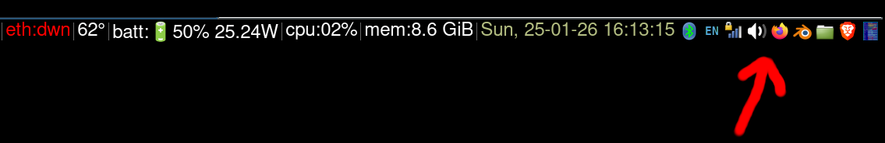

# ***XE.PY*** #

### **What is it?** ###

xe.py adds clickable buttons with PNG icons to your desktop system tray.

### **What does it look like?** ###

Here's my i3 tray with xe.py doing its thing (look at the red arrow):

## **Will it work for me?** ##

Standard desktop environments usually include this feature natively.

This was mostly designed for i3wm which does not have this feature.

However, it has been tested and seems to work fine on the following desktop
environments:

  - i3wm
  - cinnamon
  - ubuntu unity

Generally speaking, if your system tray speaks the xembed protocol, I expect
xe.py to work out of the box (caveat emptor: I haven't tried, but it will
very likely not work on wayland).

Easiest way to check if it works for you:

  - install it (see below)
  - change xeconfig.json to point at valid icon files and valid applications
    on your machine
  - launch: ./xe.py
  - ignore annoying warning messages about deprecated GTK APIs
  - see if new buttons show up in your tray
  - if they do, click on them, see what happens

## **Why?** ##

  When I write code, my - by far - prefered environments are tiling window managers.

  Specifically, I use: [i3wm](https://i3wm.org/)

  However, the original author of i3wm as well as its subsequent maintainers
  subscribe to a strict minimalist philosophy whereby everything is supposed
  to be done via the keyboard and displaying little pictures in the status bar
  generally seems to be considered bad taste 😃

  I am in fact in general agreement with that philosophy, with one exception:

  - I code on a laptop with a touchpad, which means a button click is *far*
    less costly (in terms of speed and muscle use) than it is with a mouse.

  - for apps used super often (e.g. terminals via $mod+enter) keyboard
    shortcuts is indeed **The Way**.

  - for somewhat rarely used apps, launching them via
    [dmenu](https://tools.suckless.org/dmenu/) or
    [xlunch](https://xlunch.org/), or any of the plethora of similar
    utilities, using $mod+d is a perfectly fine choice.

  - there is however a very short list of apps that fall exactly in the
    cracks separating these two cases:

     - apps launched often enough that using $mod+d launching is a giant
       PITN (too slow)

     - but apps launched not often enough that the cognitive load of
       committing a keyoard shortcut to memory for each is simply not
       worth the exertion.

  - It looks like I am not the only one feeling this way, and there are a
    number of existing solutions to the problem that make some areas of the
    i3 status bar clickable and can launch stuff.

    *However*: they all share one major shortcoming (my biased opinion):
    because the i3 status bar can only (by deliberate design choice of the
    i3 authors) display text, and all these solutions are very far from
    aesthetically pleasing. They are also much harder to spot quickly
    than icons.

    Yes, there are workarounds e.g. using hacked fonts that display little
    drawings instead of letters. Again, my own opinion here, but ... these
    are still not very nice, still hard to spot quickly because they're B&W.

    Actual pictures are:
      - *way* nicer
      - *way* faster to spot visually

  So as a result, I've been wanting to scratch this specific itch probably
  for the better part of 10 years.

  xe.py is the outcome, and, sure, not a perfect one (it's hackish, probably
  violates a large number of UI design guidelines, can only insert buttons in
  the tray and nowhere else, etc...), but ... itch scratched, I can finaly
  launch apps from nicely rendered clickable buttons in the i3 status bar.

## **The good** ##

  - does the job
  - moderate amount of dependencies
  - lightweight: 1 small python script, 1 config file

## **The bad** ##

  - likely won't work on wayland
  - purposefully violates the intended purpose of the system tray
  - currently forks one instance of xe.py per button (may be fixable)
  - relies on a old-ish protocol (xembed) that might or might not survive the next decade
  - a little bit of an ugly hack: script curently calls itself to work around the fact that
    os.fork() gives modern python the hives

## **Installation** ##

~~~
  sudo apt install gir1.2-appindicator3-0.1
  git clone https://github.com/emogenet/xe.git
  cd xe
  pip3 install -f requirements.txt
  /usr/bin/python3 ./xe.py
~~~

  - todo : check on a clean VM
  - pygobject
  - requirements.txt

